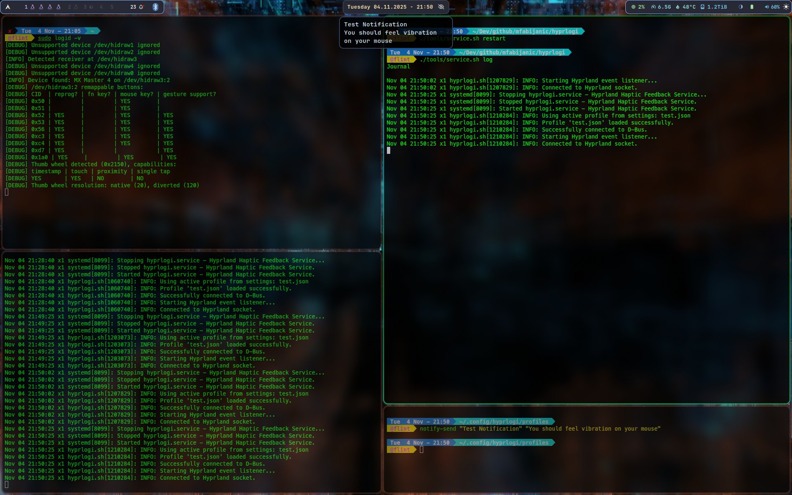

# HyprLogi - Haptic Feedback for Hyprland Events

HyprLogi is a Python-based utility that connects Hyprland's event system with Logitech devices supporting haptic feedback (like the MX Master series) via `logid`. It allows you to trigger configurable haptic effects on your mouse for various window manager events, such as changing workspaces, opening applications, or switching focus.

This provides a more tactile and immersive desktop experience, giving you physical confirmation for your actions.

## Features

- **Event-Driven Haptics**: Trigger haptic feedback on any Hyprland event.
- **Highly Configurable**: Easily map different events to over a dozen haptic effects using a simple JSON configuration file.
- **Lightweight**: Runs as a small, efficient background script.
- **Debug Mode**: Includes a verbose mode for easy troubleshooting and event discovery.

---

## Prerequisites

Before you begin, ensure you have the following installed and configured:

1.  **Hyprland**: A running and configured Hyprland Wayland compositor.
2.  **Python**: Python 3.10+ is recommended.
3.  **LogiOps with Haptic Feedback**: A specific fork of `logid` that supports haptic feedback.
    - You can find it here: [kris7t/logiops (haptic-feedback branch)](https://github.com/kris7t/logiops/tree/haptic-feedback)
4.  **Python `dbus-next` library**: To communicate with `logid`.
5.  **`socat` (Optional but Recommended)**: A powerful utility for discovering Hyprland event names.

## Installation

1.  **Clone the Repository**
    ```sh
    git clone https://github.com/mfabijanic/hyprlogi.git
    cd hyprlogi
    ```

2.  **Install `logid` with Haptic Support**
    If you haven't already, you need to build and install the specific `haptic-feedback` fork of `logid`.

    ```sh
    # Clone the repository
    git clone https://github.com/kris7t/logiops.git
    cd logiops
    git checkout haptic-feedback

    # Build and install
    mkdir build && cd build
    cmake -DCMAKE_BUILD_TYPE=Release ..
    make
    sudo make install

    # Copy the default configuration
    sudo cp ../logid.cfg /etc/
    ```
    Ensure the `logid` service is running: `sudo systemctl enable --now logid`.

3.  **Configure D-Bus**
    Copy the D-Bus policy file to allow system-wide communication with `logid`.
    ```sh
    # From the hyprlogi project directory
    sudo cp pizza.pixl.LogiOps.conf /etc/dbus-1/system.d/
    ```

4.  **Install Python Dependencies**
    It's recommended to use a virtual environment.
    ```sh
    python3 -m venv .venv
    source .venv/bin/activate
    pip install dbus-next
    ```

---

## Configuration

HyprLogi uses a profile-based system, with configurations stored in the XDG standard directory (`~/.config/hyprlogi`).

### Structure

-   `~/.config/hyprlogi/settings.json`: A simple file that points to the currently active profile.
-   `~/.config/hyprlogi/profiles/`: A directory containing all your haptic profiles.

The first time you run the script, it will automatically create this structure and copy some default profiles (`default.json`, `subtle.json`, etc.) into the `profiles` directory.

### Switching Profiles

You can switch profiles in two ways:

1.  **Edit `settings.json` (Permanent)**
    Change the `active_profile` value to the filename of the profile you want to use.
    ```json
    {
      "active_profile": "subtle.json"
    }
    ```

2.  **Use the `--profile` CLI flag (Temporary)**
    This is useful for testing a profile without changing your default setting.
    ```sh
    python3 hyprlogi.py --profile subtle
    # You can omit the .json extension
    ```

### Creating a New Profile

1.  Copy an existing profile in `~/.config/hyprlogi/profiles/`, for example:
    ```sh
    cp ~/.config/hyprlogi/profiles/default.json ~/.config/hyprlogi/profiles/my-custom.json
    ```
2.  Edit `my-custom.json` to your liking. The format maps Hyprland event names to haptic effect IDs.
    ```json
    {
      "default_effect": null,
      "events": {
        "activewindowv2": 2,
        "workspace": 5,
        "openwindow": 10,
        "closewindow": 11,
        "fullscreen": 7,
        "openlayer": {             // Example for event with specific arguments
          "default": 1,            // Default effect for any 'openlayer' event
          "args": {                // Specific effects for certain arguments
            "swaync-notification-window": 15 // Effect for 'openlayer>>swaync-notification-window'
          }
        }
      }
    }
    ```
    - `default_effect`: (Optional) The effect ID for any unlisted event. `null` disables it.
    - `events`: A dictionary where the key is the **Hyprland event name**.
        - The value can be a direct **haptic effect ID** (an integer).
        - Or, for more granular control, the value can be an **object** with:
            - `"default"`: (Optional) The effect ID to use for this event if no specific argument matches.
            - `"args"`: A dictionary mapping specific **event arguments** (e.g., `"swaync-notification-window"`) to their respective **haptic effect IDs**.

### How to Discover Hyprland Events

To find the names of events you want to use, you can listen to the Hyprland socket directly using `socat`.

1.  Open a terminal and run:
    ```sh
    socat -U - UNIX-CONNECT:$XDG_RUNTIME_DIR/hypr/$HYPRLAND_INSTANCE_SIGNATURE/.socket2.sock
    ```
2.  Perform actions in Hyprland (change windows, open apps, etc.). The terminal will print the event names. The event name is the string before the `>>`.
    ```
    workspace>>1
    activewindowv2>>5c2d140
    openwindow>>5c2d140,1,kitty,
    ```
3.  Add these event names to your `config.json`.

---

## Usage

To run the script, simply execute the Python file from within the project directory (and the virtual environment).

```sh
# Activate the virtual environment if you haven't already
source .venv/bin/activate

# Run the script
python3 hyprlogi.py
```

For troubleshooting and seeing events in real-time, use the `--debug` flag:
```sh
python3 hyprlogi.py --debug
```

### Running as a Systemd User Service (Recommended)

For robust, automatic startup, running HyprLogi as a systemd user service is the recommended method. This ensures it starts with your graphical session and restarts automatically if it ever crashes.

1.  Create the service file directory if it doesn't exist:
    ```sh
    mkdir -p ~/.config/systemd/user/
    ```

2.  Create a new service file: `~/.config/systemd/user/hyprlogi.service`

3.  Paste the following content into the file. **You must replace `/path/to/hyprlogi` with the absolute path to this project's directory.**

    ```ini
    [Unit]
    Description=Hyprland Haptic Feedback Service
    After=graphical-session.target hyprland-session.target
    PartOf=graphical-session.target

    [Service]
    # IMPORTANT: Replace with the absolute path to your project directory
    WorkingDirectory=/path/to/hyprlogi
    # Use the wrapper script to handle virtual environment or uv execution
    ExecStart=/path/to/hyprlogi/hyprlogi.sh
    Restart=on-failure
    RestartSec=5

    [Install]
    WantedBy=graphical-session.target
    ```

4.  Enable and start the service:
    ```sh
    systemctl --user daemon-reload
    systemctl --user enable --now hyprlogi.service
    ```

5.  You can check the status and logs of the service at any time with:
    ```sh
    systemctl --user status hyprlogi.service
    journalctl --user -u hyprlogi.service -f
    ```

## Acknowledgements

-   **Kristóf Marussy**: For the invaluable `logid` fork with haptic feedback support ([kris7t/logiops](https://github.com/kris7t/logiops/tree/haptic-feedback)).

## License

This project is licensed under the GNU General Public License v3.0. See the `LICENSE` file for details.
